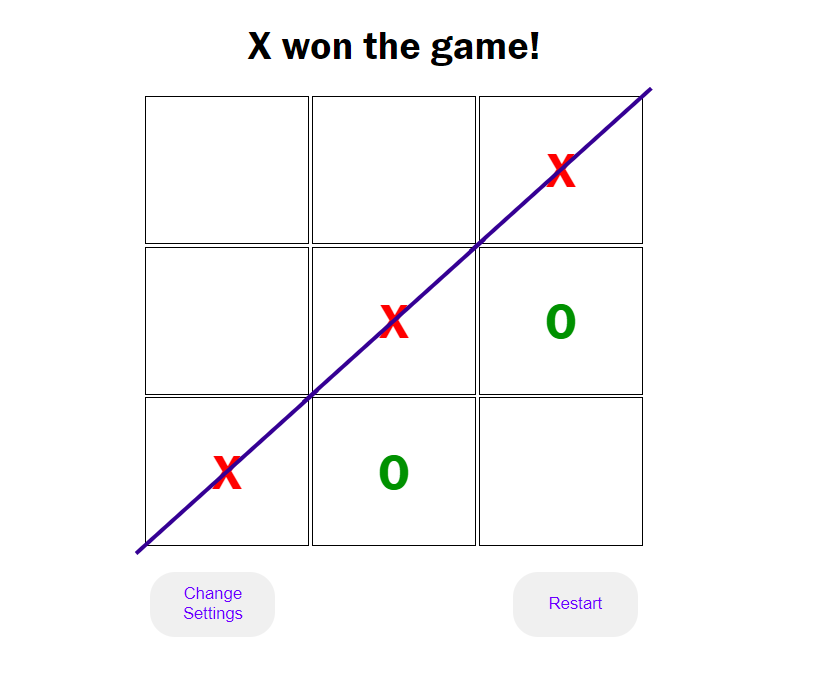

# Tic Tac Toe

## Table of Contents
* [Description](#description)
* [Technologies](#technlogies)
* [Dependencies](#dependencies)
* [Installation](#installation)
* [Try It!](#try-it)
* [License](#license)
* [Contact Me](#contact-me)

## Description
This is an application to play the famous game Tic-Tac-Toe, I used this simple to practice [Vue.js](https://vuejs.org/) framework.

## Technologies
  
  

## Dependencies
* [Lodash](https://lodash.com/)

## Installation
First of all, you need Node.js installed, you can download it [here](https://nodejs.org/it/download/).

1. Clone the repository: `https://github.com/cavaliernicola/Tic-Tac-Toe.git`
1. Install the dependencies: `npm install`
1. Build the app: `npm run build`

## Try It!
You can try this app [HERE](enchanting-arithmetic-e034c1.netlify.app)!

## License
Distributed under the MIT License. See [`LICENSE`](LICENSE) for more information.

## Contact Me
* Author: Nicola Cavalier 
* Email: cavaliernicola@gmail.com
